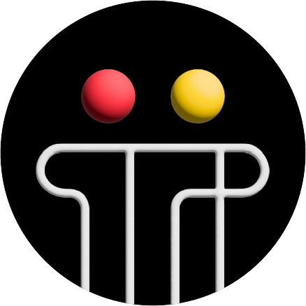

# Salut! I'm <a href="https://github.com/FabioB8a">Fabio</a> 

* 🇨🇴 I'm from Bogota, Colombia. 
* 🏫  Systems Engineering student at <a href="https://www.javeriana.edu.co/inicio">Pontificia Universidad Javeriana</a>.
* 👨🏻‍💻  I'm currently completing my internship in Back-end Development at <a href="https://tyba.com.co/?utm_term=tyba&utm_campaign=CO_Rocket_Awareness_Google_Search_Web_Alcance_CPM_AwarenessQ1&utm_source=adwords&utm_medium=ppc&hsa_acc=6971332988&hsa_cam=21270562555&hsa_grp=161925173453&hsa_ad=698769589416&hsa_src=g&hsa_tgt=kwd-873213966&hsa_kw=tyba&hsa_mt=b&hsa_net=adwords&hsa_ver=3&gad_source=1&gbraid=0AAAAACdta0DhC28-ob1Qes1peRJX6QEPa&gclid=CjwKCAjwiaa2BhAiEiwAQBgyHkx_44axA1kfO7cIP_minbxhq6XcSqzsElQsPdBXx0HGlJM6NGENyRoCQqAQAvD_BwE">tyba</a>.

## 📬 Find me at

## ⚙️ Technologies & Tools

#### Languages

![](https://img.shields.io/badge/Java-informational.svg?style=for-the-badge&logoColor=white&color=2bbc8a&logo=data:image/svg%2bxml;base64,PD94bWwgdmVyc2lvbj0iMS4wIiBlbmNvZGluZz0idXRmLTgiPz48IS0tIEdlbmVyYXRvcjogQWRvYmUgSWxsdXN0cmF0b3IgMTcuMC4yLCBTVkcgRXhwb3J0IFBsdWctSW4gLiBTVkcgVmVyc2lvbjogNi4wMCBCdWlsZCAwKSAgLS0+PCFET0NUWVBFIHN2ZyBQVUJMSUMgIi0vL1czQy8vRFREIFNWRyAxLjEvL0VOIiAiaHR0cDovL3d3dy53My5vcmcvR3JhcGhpY3MvU1ZHLzEuMS9EVEQvc3ZnMTEuZHRkIj48c3ZnIGZpbGw9IiNGRkZGRkYiIHhtbG5zPSJodHRwOi8vd3d3LnczLm9yZy8yMDAwL3N2ZyIgeG1sbnM6eGxpbms9Imh0dHA6Ly93d3cudzMub3JnLzE5OTkveGxpbmsiIHZpZXdCb3g9IjAgMCA1MCA1MCIgd2lkdGg9IjUwcHgiIGhlaWdodD0iNTBweCI+PGc+PHBhdGggZD0iTTI0LjY0NiwyNi4xMjFjLTEuMzAyLTIuMDE0LTIuMjQyLTMuNjgtMy41NDgtNi44MTdjLTIuMjA4LTUuMzA2LDEzLjQzMy0xMC4xLDcuMDg3LTE5LjMwNmMyLjc1LDYuMzYzLTkuODYzLDEwLjI5MS0xMS4wMzQsMTUuNTkzQzE2LjA3NSwyMC40NjIsMjQuNjM5LDI2LjEyMSwyNC42NDYsMjYuMTIxeiIvPjxwYXRoIGQ9Ik0yNC45NDIsMTYuNTgzYy0wLjI1MSwzLjE0OCwyLjkwMyw0LjgyOCwyLjk5Myw3LjExOWMwLjA3MywxLjg3MS0xLjg4NSwzLjQyOC0xLjg4NSwzLjQyOHMzLjU1Mi0wLjY2Nyw0LjY2Mi0zLjUyNGMxLjIzMS0zLjE2Ny0yLjM4Ni01LjMzMS0yLjAxOS03Ljg2N2MwLjM1MS0yLjQyNiw3Ljg1OC02LjkyOCw3Ljg1OC02LjkyOFMyNS41MDUsOS41MTEsMjQuOTQyLDE2LjU4M3oiLz48cGF0aCBkPSJNMzUuNjI1LDI2LjMxNWMyLjI4My0wLjQ5Miw0LjIxMSwwLjkwNCw0LjIxMSwyLjUxNWMwLDMuNjI0LTUuMjM2LDcuMDQ5LTUuMjM2LDcuMDQ5czguMTA4LTAuOTI3LDguMTA4LTYuODgxQzQyLjcwOCwyNS4wNjUsMzguNzI1LDI0LjA4NCwzNS42MjUsMjYuMzE1eiIvPjxwYXRoIGQ9Ik0zMS43NzksMjkuMjRjMCwwLDIuNTI5LTEuNzMsMy4yMDEtMi4zNzZjLTYuMjAyLDEuMjY0LTIwLjM2LDEuNDMyLTIwLjM2LDAuMzM3YzAtMS4wMDksNC41NjMtMi4wNDksNC41NjMtMi4wNDlzLTEwLjEyLTAuMTM5LTEwLjEyLDIuNzI2QzkuMDY0LDMwLjg2OSwyMi4zMTUsMzEuMDgsMzEuNzc5LDI5LjI0eiIvPjxwYXRoIGQ9Ik0zMC4yMjMsMzEuOTZjLTUuODY3LDEuODc4LTE2LjY4NSwxLjI3Ni0xMy40ODMtMS4yMzhjLTEuNTU0LDAtMy44NywxLjIwMi0zLjg3LDIuMzU3YzAsMi4zMjUsMTEuNjkzLDQuMTE1LDIwLjM0OSwwLjcxOUwzMC4yMjMsMzEuOTZ6Ii8+PHBhdGggZD0iTTE4LjE4LDM1LjkyMmMtMi4xMjgsMC0zLjUwOSwxLjMxNS0zLjUwOSwyLjI4YzAsMi45ODUsMTIuNzA4LDMuMjg2LDE3Ljc0NCwwLjI1MWwtMy4yLTIuMDM3QzI1LjQ1NCwzOC4wMDcsMTYuMDA4LDM4LjIyMiwxOC4xOCwzNS45MjJ6Ii8+PHBhdGggZD0iTTQwLjg5LDQwLjkyNGMwLTEuMTY3LTEuMzc0LTEuNzIxLTEuODctMS45ODZjMi45MDEsNi43MTgtMjkuMDUyLDYuMTk2LTI5LjA1MiwyLjIzM2MwLTAuOTA0LDIuMzQ3LTEuNzg3LDQuNTI1LTEuMzY1bC0xLjg0OC0xLjA0OWMtNC4zMzUtMC42NTUtNy4yNzksMS4xNzEtNy4yNzksMi42NDhDNS4zNjUsNDguMjgxLDQwLjg5LDQ3Ljk1LDQwLjg5LDQwLjkyNHoiLz48cGF0aCBkPSJNNDQuNjM1LDQzLjI1Yy01LjQsNS4xMTktMTkuMDg5LDYuOTg0LTMyLjg1MywzLjgyM0MyNS41NDUsNTIuNzA0LDQ0LjU2Nyw0OS41MzYsNDQuNjM1LDQzLjI1eiIvPjwvZz48L3N2Zz4=)

![](https://img.shields.io/badge/C%23-informational.svg?style=for-the-badge&logoColor=white&color=555555&logo=data:image/svg%2bxml;base64,PHN2ZyB4bWxucz0iaHR0cDovL3d3dy53My5vcmcvMjAwMC9zdmciIHhtbG5zOnhsaW5rPSJodHRwOi8vd3d3LnczLm9yZy8xOTk5L3hsaW5rIiB2aWV3Qm94PSIwLDAsMjU2LDI1NiIgd2lkdGg9IjUwcHgiIGhlaWdodD0iNTBweCIgZmlsbC1ydWxlPSJub256ZXJvIj48ZyBmaWxsPSIjZmZmZmZmIiBmaWxsLXJ1bGU9Im5vbnplcm8iIHN0cm9rZT0ibm9uZSIgc3Ryb2tlLXdpZHRoPSIxIiBzdHJva2UtbGluZWNhcD0iYnV0dCIgc3Ryb2tlLWxpbmVqb2luPSJtaXRlciIgc3Ryb2tlLW1pdGVybGltaXQ9IjEwIiBzdHJva2UtZGFzaGFycmF5PSIiIHN0cm9rZS1kYXNob2Zmc2V0PSIwIiBmb250LWZhbWlseT0ibm9uZSIgZm9udC13ZWlnaHQ9Im5vbmUiIGZvbnQtc2l6ZT0ibm9uZSIgdGV4dC1hbmNob3I9Im5vbmUiIHN0eWxlPSJtaXgtYmxlbmQtbW9kZTogbm9ybWFsIj48ZyB0cmFuc2Zvcm09InNjYWxlKDUuMTIsNS4xMikiPjxwYXRoIGQ9Ik0yNSwyYy0wLjcxNDg0LDAgLTEuNDI5NjksMC4xNzk2OSAtMi4wNjY0MSwwLjUzOTA2bC0xNi44NDM3NSw5LjQ2NDg0Yy0xLjI4OTA2LDAuNzIyNjYgLTIuMDg5ODQsMi4wNzgxMyAtMi4wODk4NCwzLjUzMTI1djE4LjkyOTY5YzAsMS40NTMxMyAwLjgwMDc4LDIuODA4NTkgMi4wODk4NCwzLjUzMTI1bDE2Ljg0Mzc1LDkuNDY0ODRjMC42MzY3MiwwLjM1OTM4IDEuMzUxNTYsMC41MzkwNiAyLjA2NjQxLDAuNTM5MDZjMC43MTQ4NCwwIDEuNDI5NjksLTAuMTc5NjkgMi4wNjY0MSwtMC41MzkwNmwxNi44NDM3NSwtOS40NjA5NGMxLjI4OTA2LC0wLjcyNjU2IDIuMDg5ODQsLTIuMDgyMDMgMi4wODk4NCwtMy41MzUxNnYtMTguOTI5NjljMCwtMS40NTMxMiAtMC44MDA3OCwtMi44MDg1OSAtMi4wODk4NCwtMy41MzEyNWwtMTYuODQzNzUsLTkuNDY0ODRjLTAuNjM2NzIsLTAuMzU5MzcgLTEuMzUxNTYsLTAuNTM5MDYgLTIuMDY2NDEsLTAuNTM5MDZ6TTI1LDEzYzMuNzgxMjUsMCA3LjI3NzM0LDEuNzUzOTEgOS41NDI5Nyw0LjczODI4bC00LjM4MjgxLDIuNTM5MDZjLTEuMzE2NDEsLTEuNDQxNDEgLTMuMTg3NSwtMi4yNzczNCAtNS4xNjAxNiwtMi4yNzczNGMtMy44NTkzNywwIC03LDMuMTQwNjMgLTcsN2MwLDMuODU5MzggMy4xNDA2Myw3IDcsN2MxLjk3MjY2LDAgMy44NDM3NSwtMC44MzU5NCA1LjE2MDE2LC0yLjI3NzM0bDQuMzgyODEsMi41MzkwNmMtMi4yNjU2MiwyLjk4NDM4IC01Ljc2MTcyLDQuNzM4MjggLTkuNTQyOTcsNC43MzgyOGMtNi42MTcxOSwwIC0xMiwtNS4zODI4MSAtMTIsLTEyYzAsLTYuNjE3MTkgNS4zODI4MSwtMTIgMTIsLTEyek0zNSwyMGgydjJoMnYtMmgydjJoMnYyaC0ydjJoMnYyaC0ydjJoLTJ2LTJoLTJ2MmgtMnYtMmgtMnYtMmgydi0yaC0ydi0yaDJ6TTM3LDI0djJoMnYtMnoiPjwvcGF0aD48L2c+PC9nPjwvc3ZnPg==)

#### BackEnd Frameworks

(Currently focusing on Serverless Framework and .Net 👨🏻‍💻)

#### Cloud

(Currently focusing on AWS and Microsoft Azure 👨🏻‍💻) 

#### Tools

(Currently focusing on learning more about CI/CD 👨🏻‍💻) 

#### OS

## 📬 Projects I'm most proud of

<table>
  <tr>
    <td>
      
    </td>
    <td>
      Totto x El Mundo • Totto Crea 2023 Contest 
       • Individual development of a website using Next.js that integrates a chatbot prototype based on the Open AI API, 
       as part of the proposed 360 Strategy for the Totto Crea 2023 Contest.  
       • The group managed to position itself among the top 10 finalists out of 400 participants. 
    </td>
     
  </tr>
 
</table>

## ⚡️ A Few Quick Facts

* 🎹 I love playing the piano and diving into music theory. Right now, I’m learning to play <a href="https://www.youtube.com/watch?v=l4O9lB0A9ns&list=RDMMl4O9lB0A9ns&start_radio=1">Kimi no na wa OST - Kataware Doki (Piano)</a>, by Theister.
* 🔭 Ever since I was a kid, I’ve been fascinated by astronomy, astrophotography, and cosmology. Someday soon, I hope to be involved in a project related to these passions.
* 🏊 I’ve just started swimming classes! It’s something I’ve loved since I was a kid, so I’m excited to get back into it.
* 🗣️ I am fluent in three languages: Spanish 🇪🇸 (my first language), English 🇬🇧, and French 🇫🇷. Now, I’m picking up some Korean 🇰🇷.
* 🎥 I’m a big fan of anime—no surprise, given my love for music. My all-time favorite series are Mushishi, Monster, and Sangatsu no Lion.
* 📺 I’m also into K-dramas. My favorites right now are A Daily Dose of Sunshine, The Good Bad Mother, and Move to Heaven.

(Currently working on StudyBuddy and GlaucomApp 👨🏻‍💻)

